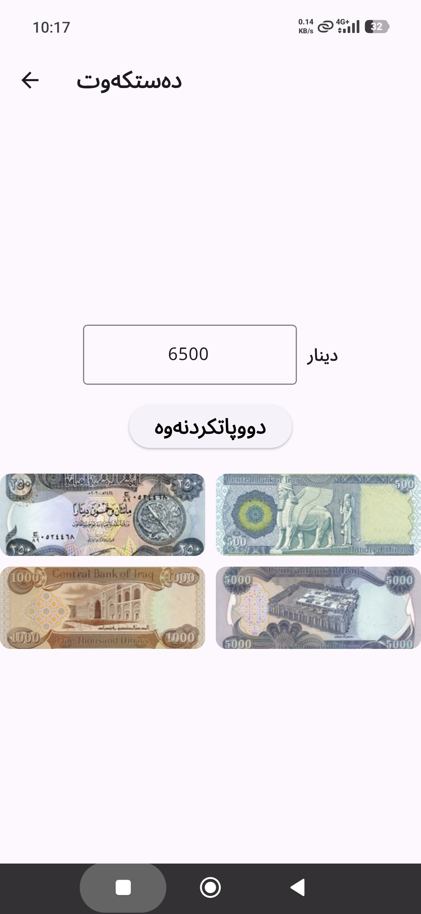
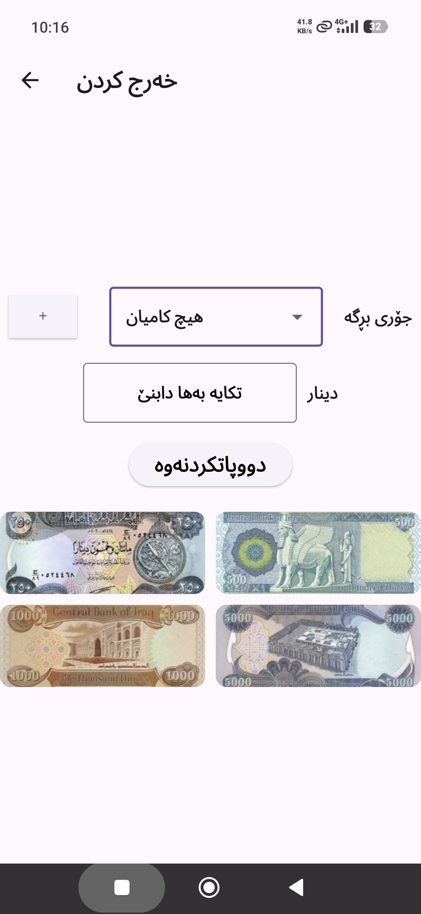
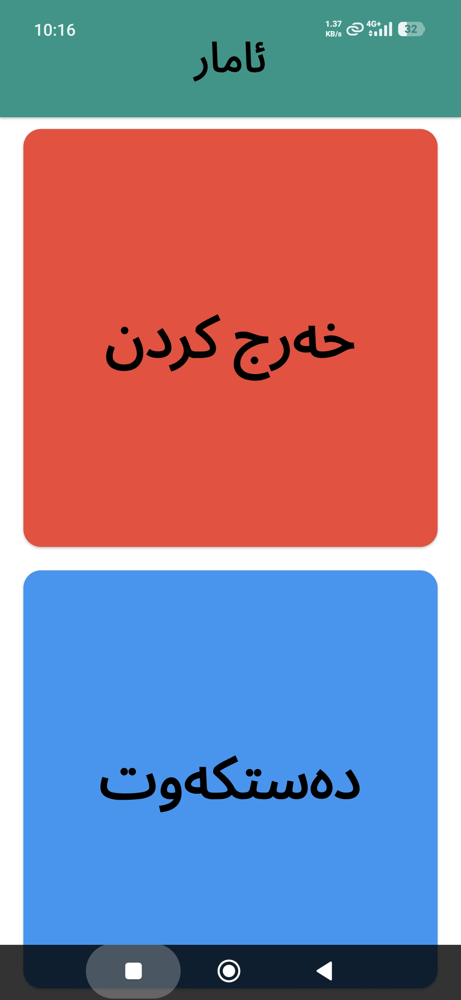
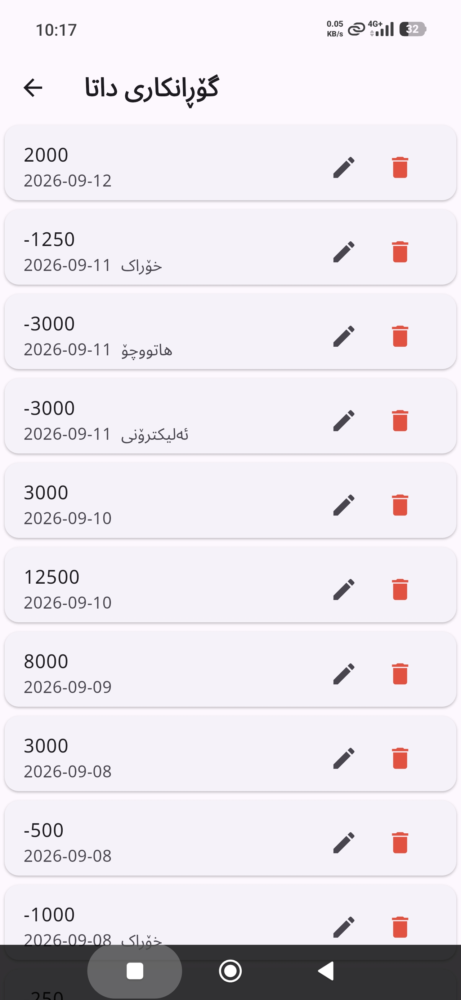
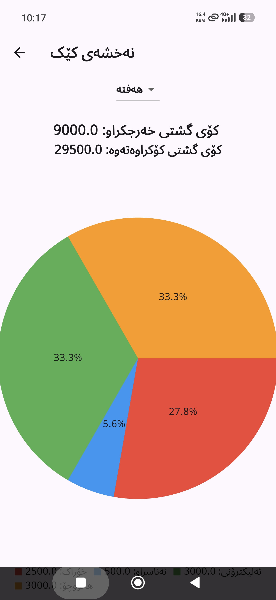
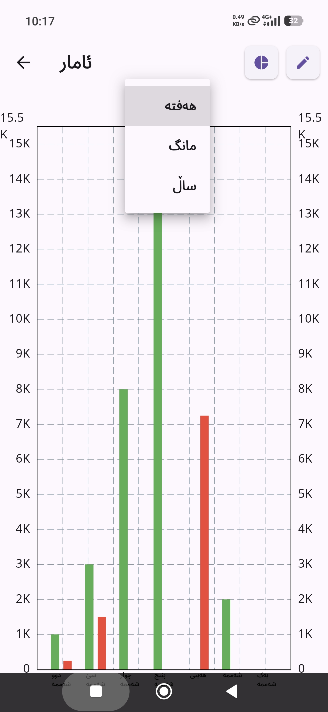

# 📊 Kurdish Finance Tracker

A simple Flutter app for tracking **income and expenses in Iraqi Dinars (IQD)**.

The app is made for Kurdish users and works **fully offline**. Your financial data stays on your device.

## ✨ Features

- 🌍 **Kurdish language support**
  - RTL Kurdish interface
  - Noto Arabic font

- 💵 **Quick cash buttons**
  - 250 IQD
  - 500 IQD
  - 1,000 IQD
  - 5,000 IQD

- 📈 **Income & expense charts**
  - Compare income and expenses
  - Weekly, monthly, and yearly views

- 🥧 **Expense categories**
  - See where your money goes
  - Pie chart with percentages

- 📝 **Transaction history**
  - View previous transactions
  - Edit or delete transactions

- 🔒 **Private and offline**
  - No online account needed
  - Data is stored locally on your device

## 📱 Screenshots

### Home & Transactions

<p align="center">
  
  
  
</p>

### Statistics & Reports

<p align="center">
  
  
  
</p>

## 🛠️ Built With

- **Flutter**
- **Dart**
- **fl_chart**
- **Noto Arabic**
- Local file storage

## 📁 Project Structure

| File | Description |
|---|---|
| `main.dart` | Starts the app and sets up the main theme |
| `insert_screen.dart` | Add income |
| `remove_screen.dart` | Add expenses |
| `add_type.dart` | Manage expense categories |
| `total_screen.dart` | Income and expense statistics |
| `pie_chart.dart` | Expense category chart |
| `edit_screen.dart` | View, edit, and delete transactions |
| `storage_service.dart` | Saves and loads local data |

## 🚀 Getting Started

### Requirements

- Flutter
- Dart
- Android device or emulator

### Installation

```bash
git clone <repository-url>
cd money_tracker
flutter pub get
flutter run
```

## 📦 Version

**v1.0.0+1**

Made with Flutter for Kurdish users 🇹🇯
